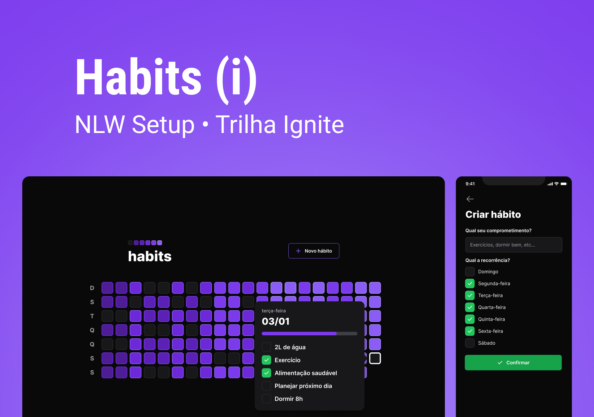

# NLW Setup

<div align="center"></div>

<div align="center">
    
    
</div>



- This is a project developed under NLW Setup event.

## 🛠️ How running?

```bash
# clone this repo
git clone git@github.com:joaovictor3g/nlw-setup.git

# run frontend mobile or web
(cd mobile || cd frontend) && npm run start

# install all dependencies
npm i

# run api
cd backend && npm run dev

#run
yarn dev
```
